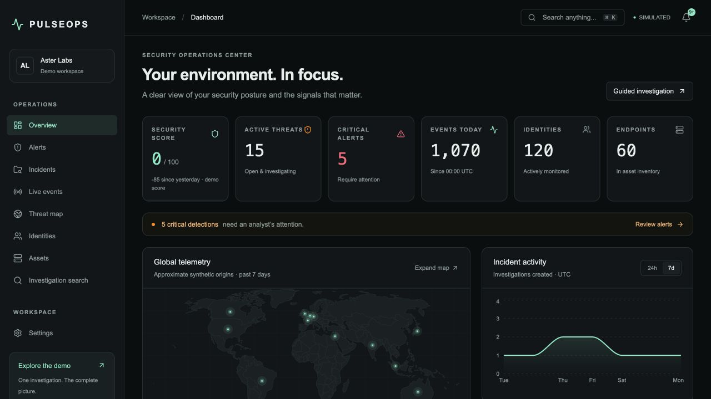
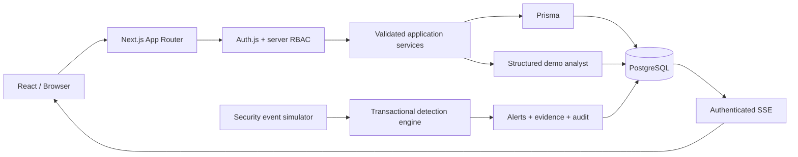
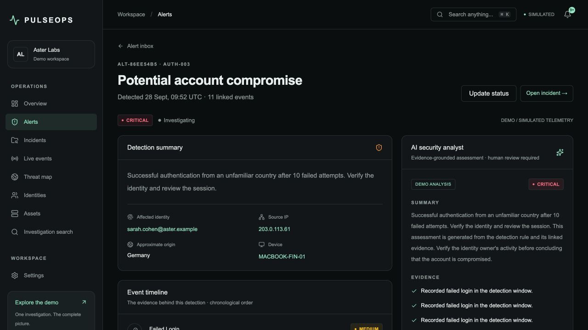
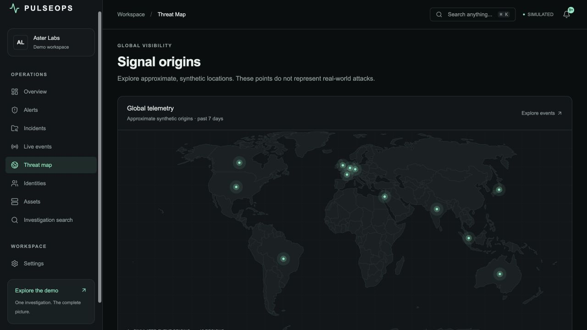
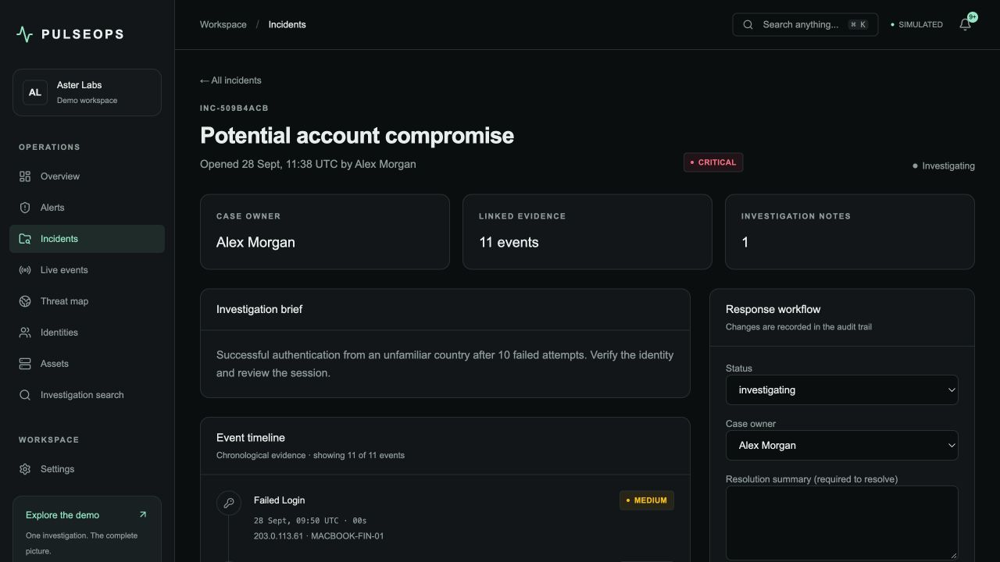

# PulseOps

**AI-Powered Security Operations Center**

A defensive SOC portfolio application: follow a signal from synthetic telemetry to an explainable detection, a structured assessment and a documented investigation.

[](https://github.com/Lior41/pulseops/actions/workflows/ci.yml)

     

> All telemetry is fictional. The currently enabled analyst is a **clearly labelled local demo**; no external language model is called. Test execution status and deployment limitations are documented in [Validation](docs/VALIDATION.md).



## Live Demo

Run locally at **http://localhost:3000** and choose **Try demo account**. No cloud deployment URL has been published yet. The application includes a five-minute guided tour at `/demo`.

| Account               | Role    | Password                                                                     |
| --------------------- | ------- | ---------------------------------------------------------------------------- |
| `demo@pulseops.dev`   | Analyst | `PulseOps-Demo-2026!` with the default demo configuration                    |
| `viewer@pulseops.dev` | Viewer  | Same configured `DEMO_PASSWORD`                                              |
| `admin@pulseops.dev`  | Admin   | Created only when a private `ADMIN_PASSWORD` is provided to the initial seed |

The public demo is a shared fictional workspace. Changes persist and may be visible to another recruiter. Never connect this public account to real telemetry.

## Overview

PulseOps models the analyst's work, beyond displaying charts. A detection has an explicit rule, a time window and evidence. Escalating it creates an incident with the same evidence. Notes, status changes and role changes are stored with audit records. A stale update is rejected rather than silently overwriting another analyst's work.

The code is intentionally a modular monolith: one TypeScript application, one relational database, and a small optional worker. No unnecessary microservices or message broker.

## Features

- Dark-first responsive SOC dashboard with database-derived metrics, 24h/7d incident charts, category/severity distribution and score history.
- Geographic visualization rendered from a real world geometry dataset, with explicitly simulated country-level origins.
- Durable synthetic event ingestion, weighted simulation and correlated detection rules.
- Authenticated SSE feed with pause/resume, reconnect cursor, local filters and bounded client memory.
- Alert search, severity/status/country/date/category filters, sorting, pagination and evidence timelines.
- Incident creation, owner assignment, controlled status transitions, resolution summaries and persisted notes.
- Structured, validated demo analysis with evidence links, recommendations, illustrative confidence and limitations.
- Monitored identity profiles, devices, IP/country history, asset inventory and cross-resource investigation search.
- Command palette (`⌘K` / `Ctrl+K`), theme switch, notifications and account preferences.
- Server-enforced ADMIN/ANALYST/VIEWER permissions, revocable sessions, protected mutations and administrator audit logs.
- Seed with 12,000 baseline events, correlated scenarios, 120 fictional identities, 60 assets, alerts, incidents and notifications.

## Architecture



Read [ARCHITECTURE.md](docs/ARCHITECTURE.md) for implementation details and tradeoffs, [DATA_MODEL.md](docs/DATA_MODEL.md) for relationships, and [INTERVIEW.md](docs/INTERVIEW.md) for a French interview preparation guide.

## Tech Stack

| Layer          | Implementation                                                             |
| -------------- | -------------------------------------------------------------------------- |
| Interface      | Next.js 16 App Router, React 19, strict TypeScript                         |
| UI             | Tailwind CSS 4, owned shadcn/ui components, Radix primitives, Lucide       |
| Visualization  | Recharts, D3 geographic projection, Natural Earth geometry via world-atlas |
| Server         | Server Components, Server Actions, Route Handlers                          |
| Data           | PostgreSQL 17, Prisma 7 with the pg adapter                                |
| Authentication | Auth.js v5 **beta**, Credentials, Argon2id, JWT cookies                    |
| Validation     | Zod schemas at service and stream boundaries                               |
| Real time      | SSE / EventSource; database-coordinated simulator                          |
| Quality        | ESLint, Prettier, Vitest, Testing Library, Playwright                      |
| Delivery       | Multi-stage Docker build, Compose, GitHub Actions; Vercel deployment guide |

Exact versions are pinned in `package-lock.json`. PGlite is an optional **development-only** PostgreSQL WASM runner for machines without Docker; production uses PostgreSQL.

## Security Detection Engine

| Detection                                                                               | Window        | Severity      |
| --------------------------------------------------------------------------------------- | ------------- | ------------- |
| 5 failed logins for the same identity                                                   | 5 minutes     | MEDIUM        |
| 15 failed logins from the same IP                                                       | 5 minutes     | HIGH          |
| 10 failures followed by a successful login flagged as a new country                     | 5 minutes     | CRITICAL      |
| Simulated malware, privilege escalation, API abuse, brute force and suspicious download | Direct signal | Rule-specific |

Rules are pure functions. Ingestion validates the event and persists the event, detections, evidence, audit and critical notifications in a transaction. A unique source/event key makes retries idempotent. A five-minute suppression window prevents repeated notifications for the same rule occurrence.

The database history is bounded to 500 relevant failures. This is a portfolio-scale engine, not a claim of production SIEM throughput. The global ingestion lock is intentionally simple and documented.

Security score: `max(0, 100 − active severity weights)`, with weights 1 / 3 / 7 / 12. It is an educational heuristic. Dashboard aggregates are snapshots; the feed streams live events.

## AI Analysis

**Available now:** local deterministic analysis, explicitly labelled DEMO. It returns a summary, risk level, evidence references, recommended actions, confidence and limitations. Zod validates the structure; reference validation rejects evidence outside the alert. Results are persisted with the actor, mode, prompt version and evidence hash.

**External integration:** not enabled. An allowlisted context builder and tests already strip names, emails, IPs, absolute timestamps, DB identifiers and free text. Connecting a model requires explicit authorization and a provider implementation; merely adding a key does not pretend to enable live AI. No model can execute a remediation action.

## Screenshots

These are real captures of the running application. Data and the analyst assessment are explicitly simulated. See [the capture instructions](public/screenshots/README.md) to regenerate them.







## Getting Started

Requires Node.js **24 LTS** and npm. From the repository directory:

```bash
npm ci
npm run demo
```

The demo command creates a private local `.env` only if absent, starts a persistent local PGlite database if needed, applies migrations, seeds fictional data, builds the app and starts it. Open **http://localhost:3000**. Keep the terminal running; `Ctrl+C` stops the processes it started. Port 3000 must be free. Existing seeded investigations are preserved.

For your own PostgreSQL instance:

```bash
cp .env.example .env
# Set DATABASE_URL and a random AUTH_SECRET in .env.
npm ci
npm run db:generate
npm run db:migrate
npm run db:seed
npm run dev
```

The seed requires `DEMO_MODE=true` and a 12+ character demo password. Use a dedicated demo database. For local production preview, run `npm run build` then `npm start`.

If macOS reports too many file watchers during development, use `WATCHPACK_POLLING=true npm run dev -- --webpack`. The normal demo command uses the production server and does not rely on file watchers.

## Environment Variables

| Variable            | Purpose                                                                |
| ------------------- | ---------------------------------------------------------------------- |
| `DATABASE_URL`      | PostgreSQL connection string; use the provider's TLS settings remotely |
| `AUTH_SECRET`       | Random private secret, at least 32 characters; never commit it         |
| `AUTH_URL`          | Exact public application origin, or `http://localhost:3000` locally    |
| `AUTH_TRUST_HOST`   | Set `true` only for the configured trusted host/proxy                  |
| `DEMO_MODE`         | Enables demo login presentation and synthetic generation               |
| `DEMO_PASSWORD`     | Shared analyst/viewer password for initial seed                        |
| `ADMIN_PASSWORD`    | Optional private initial admin password; no default                    |
| `POSTGRES_PASSWORD` | Local Compose PostgreSQL password                                      |
| `TEST_DATABASE_URL` | Separate disposable test database ending in `_test`                    |
| `LOCAL_DB_PORT`     | Optional PGlite development port, default 54329                        |

Changing seed passwords does not change existing accounts. Keep demo and non-demo environments separate. Never import customer logs into the public demo.

## Running with Docker

```bash
cp .env.example .env
# Replace AUTH_SECRET with: openssl rand -base64 32
# Optionally set a private ADMIN_PASSWORD before the first run.
docker compose up --build
```

Compose starts PostgreSQL, runs migrations and idempotent seeding, then starts the standalone app and simulator. Visit http://localhost:3000. PostgreSQL is not exposed on a host port; the app binds to localhost. Database data lives in a named volume and survives `docker compose down`.

Docker was prepared but cannot be executed on the implementation machine because Docker is not installed. Validate this path on a Docker-enabled host before using it for a demonstration.

## Tests

```bash
npm run check          # lint + strict TypeScript + unit/component tests
npm run format:check
npm run build
npm run test:integration   # requires TEST_DATABASE_URL + applied migrations
npx playwright install chromium
npm run test:e2e           # production build required; starts the app if needed
```

Apply migrations to a separate `pulseops_test` database before integration tests. CI provisions PostgreSQL 17, runs integration tests, seeds the test database and runs the browser workflow. Tests never truncate an application database. See [VALIDATION.md](docs/VALIDATION.md) for actual local results, including the macOS browser-launch limitation.

## Project Structure

```text
src/
  app/          pages, layouts, server actions and HTTP handlers
  components/   shell, accessible UI primitives and shared views
  features/     alerts, incidents, dashboard, authentication and live feed
  lib/          domain schemas, wire contracts and pure utilities
  server/
    auth/       permissions, session checks and transactional authorization
    ai/         structured demo analysis and allowlisted future context
    db/         Prisma client and pool
    detection/  pure rules and transactional ingestion
    services/   investigation, search, notifications and settings
    simulation/ weighted generator and coordinated tick
prisma/         schema, migrations and realistic idempotent seed
scripts/        local demo, standalone startup and simulator worker
tests/          unit, component, database integration and E2E tests
docs/           architecture, deployment, validation and interview guide
```

## Deployment

The source is published at [Lior41/pulseops](https://github.com/Lior41/pulseops). Vercel with a compatible remote PostgreSQL database is documented in [DEPLOYMENT.md](docs/DEPLOYMENT.md). Schema changes are applied explicitly before promotion. The browser-driven demo simulator works with short-lived SSE functions; no always-running worker is assumed on Vercel. A live application deployment remains to be configured.

## Roadmap

- Authorized external structured AI provider with refusal/timeout handling and evaluation fixtures.
- Enterprise SSO/MFA and a proper invitation/password-recovery flow.
- Multi-alert linking, configurable detection policies and richer investigation exports.
- Durable ingestion queue, per-subject concurrency, retention jobs and load tests.
- PostgreSQL full-text/trigram search and multi-tenant isolation if there is an actual product need.
- Automated accessibility checks and broader mobile browser coverage.

## What I Learned

Engineering topics this project is designed to demonstrate:

- Authentication and authorization are separate; a hidden button does not protect a mutation.
- Transactions, evidence links and optimistic versions make the analyst workflow reliable.
- Realtime delivery needs reconnection and memory limits, not just a timer in a component.
- A structured analyst output needs validation and honest provenance before it is useful.
- A maintainable monolith can demonstrate substantial full-stack design without distributed infrastructure.

Before presenting this as your own learning, walk through the code and adapt these points to your actual experience. The [interview guide](docs/INTERVIEW.md) includes practical exercises.

## Disclaimer

This project uses simulated security telemetry and is designed for defensive cybersecurity education and portfolio demonstration.

It is not a production monitoring service, compliance certification or a replacement for a security team. No scanning, exploitation, malware execution, credential theft or automated action against real systems is implemented.

MIT licensed. World geometry is sourced from the public-domain Natural Earth dataset through world-atlas.
