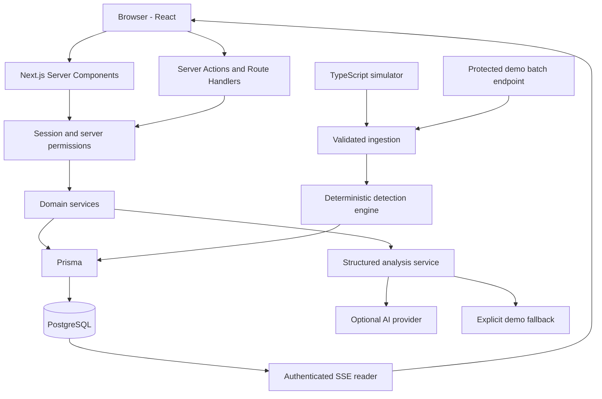

# PulseOps — architecture

Statut : phase 2, architecture cible décidée le 28 septembre 2026. Aucun composant applicatif n'est encore implémenté. Les versions exactes seront confirmées lors de l'installation.

## Architecture globale

Un monolithe modulaire Next.js regroupe interface, entrées serveur et services métier. Un petit processus TypeScript exécute la simulation en Docker et partage les mêmes services. PostgreSQL est la source de vérité. Pas de second backend Python : il n'apporterait pas ici de capacité justifiant son coût de maintenance.



Les lectures serveur appellent les services directement, sans requête HTTP interne. Les mutations de formulaires utilisent des Server Actions. Auth, SSE, recherche asynchrone et génération demo utilisent des Route Handlers.

## Choix techniques

| Choix | Justification |
| --- | --- |
| Next.js récent, App Router, React, TypeScript strict | Une base UI/backend ; Server Components par défaut, composants clients ciblés |
| Runtime Node.js | Compatibilité Prisma, hash des mots de passe, scripts et Docker |
| Tailwind, shadcn/ui, Lucide | Primitives accessibles composées dans une identité visuelle propre |
| Recharts et carte SVG locale | Graphiques et géographie sans service cartographique payant |
| PostgreSQL + Prisma | Relations, contraintes, transactions et migrations versionnées |
| Auth.js Credentials + JWT | Connexion email/password, avec stockage et vérification des comptes côté serveur |
| Zod | Validation des entrées, environnement, filtres et réponses IA |
| SSE | Flux serveur vers navigateur suffisant pour le feed |
| Vitest, Testing Library, Playwright | Logique métier, interactions et parcours navigateur |
| Docker Compose et GitHub Actions | Reproductibilité locale et vérifications automatiques |

Installer des versions publiées compatibles et committer le lockfile. Vérifier les peer dependencies et le statut stable ou préliminaire d'Auth.js ; documenter le compromis sans le masquer. La documentation Next.js consultée décrit la branche 16 et un lint indépendant du build.

## Structure cible

```text
pulseops/
├── src/
│   ├── app/
│   │   ├── (auth)/login/
│   │   ├── (soc)/dashboard/
│   │   ├── (soc)/alerts/[id]/
│   │   ├── (soc)/incidents/[id]/
│   │   ├── (soc)/users/[id]/
│   │   ├── (soc)/assets/[id]/
│   │   ├── (soc)/threat-map/
│   │   ├── (soc)/events/
│   │   ├── (soc)/search/
│   │   ├── (soc)/audit/
│   │   ├── (soc)/settings/
│   │   ├── (soc)/demo/
│   │   └── api/
│   ├── components/        # Primitives UI et shell
│   ├── features/          # Composants et schémas par domaine
│   ├── server/
│   │   ├── auth/          # Session, permissions, hash, limites
│   │   ├── db/            # Prisma et requêtes partagées
│   │   ├── services/      # Alertes, incidents, recherche, audit
│   │   ├── detection/     # Règles pures et orchestration
│   │   ├── simulation/    # Scénarios, distributions, horloge
│   │   └── ai/            # Contexte, fournisseur et validation
│   ├── hooks/             # SSE et raccourcis réutilisables
│   ├── lib/               # Formatage et utilitaires purs
│   └── types/             # Contrats partagés si nécessaires
├── prisma/                # Schéma, migrations, seed
├── scripts/               # Simulateur et opérations demo
├── tests/{unit,integration,e2e}/
├── public/
├── docs/
└── .github/workflows/
```

Les schémas Zod restent proches de leur domaine. `server-only` protège les modules sensibles importés par Next.js ; le cœur pur partagé avec les scripts reste indépendant de React. Pas de repository générique ou de conteneur d'injection sans besoin réel.

## Authentification et autorisation

Auth.js gère le protocole de session. Notre provider Credentials valide avec Zod, limite les tentatives, charge User et vérifie un hash Argon2id. Le message d'échec est générique. Un hash factice pour les comptes absents limite les écarts grossiers de temps.

JWT en cookie HttpOnly, Secure en production, SameSite adapté. Aucun token dans localStorage. Le token contient l'identifiant et une version de session. Chaque accès protégé recharge le rôle, l'état actif et `sessionVersion` en DB. Une désactivation ou incrémentation de version révoque l'accès sans attendre l'expiration du JWT. Durée fixe courte ; pas de case remember me décorative.

Le provider Credentials impose les sessions JWT dans la documentation Auth.js consultée. Account et Session restent prévus pour la compatibilité de l'adapter et une évolution OAuth, sans fausses lignes Session pour les connexions Credentials. Le seed crée les comptes, car Credentials ne les persiste pas automatiquement.

Le compte demo utilise `demo@pulseops.dev`. Son mot de passe est défini par la configuration de démonstration et hashé par le seed. Le bouton « Try demo account » utilise le flux de connexion normal ; il ne contourne jamais les contrôles serveur. Ce mot de passe de démo publique n'est pas traité comme un secret de production. Le compte ADMIN possède des identifiants privés distincts, jamais affichés.

| Action | VIEWER | ANALYST | ADMIN |
| --- | --- | --- | --- |
| Lire les données SOC | Oui | Oui | Oui |
| Analyser avec IA | Non | Oui | Oui |
| Modifier une alerte, créer/commenter/résoudre un incident | Non | Oui | Oui |
| Consulter l'audit administratif | Non | Non | Oui |
| Gérer ses préférences et notifications | Oui | Oui | Oui |
| Modifier rôles et paramètres globaux | Non | Non | Oui |
| Déclencher simulation | Non | Si DEMO | Si DEMO |

Chaque entrée serveur vérifie une permission centrale. Le layout protège la navigation mais ne constitue pas la seule barrière. Une notification appartient à un destinataire précis. Un owner d'incident doit être un analyste ou admin actif. Le dernier ADMIN actif ne peut pas être rétrogradé.

Les mutations sensibles revalident l'acteur dans leur transaction ; un verrou par acteur partagé avec les changements de rôle évite une course de révocation. Le SSE revalide lors des reconnexions et périodiquement ; sa fenêtre maximale de révocation sera testée.

Le rate limiting utilise des compteurs atomiques PostgreSQL avec expiration, adaptés au faible volume. Clés par action, utilisateur ou hash HMAC d'IP de confiance, plus plafond global. Ne pas faire confiance à un header IP arbitraire ; accepter l'IP transmise seulement avec un proxy explicitement configuré.

## Données et invariants

Le [modèle détaillé](DATA_MODEL.md) sépare les comptes SOC, les personnes surveillées et les preuves.

- Une alerte référence ses événements probants ; ils ne sont pas reconstruits depuis un texte IA.
- Une alerte appartient au maximum à un incident en V1 ; un incident regroupe plusieurs alertes.
- Conversion, liens de preuves, audit et notifications sont atomiques.
- Clé source idempotente sur chaque événement ; un retry ne duplique pas les effets.
- L'ingestion acquiert un verrou transactionnel global avant insertion. Le faible débit cible accepte cette sérialisation, qui évite les courses du moteur et ordonne les commits pour SSE.
- Les mises à jour d'alerte/incident portent une version optimiste ; un conflit demande un rafraîchissement.
- Aucun appel IA externe dans une transaction DB.
- Événements et audits append-only dans l'application ; aucune promesse d'inviolabilité face à un administrateur DB.
- Migrations versionnées ; pas de `db push` comme procédure de production ni seed destructif au démarrage.

## Simulation et moteur de détection

Les événements sont des données, jamais des actions réseau. Horloge et générateur pseudo-aléatoire sont injectables.

Distribution initiale : NORMAL_LOGIN 64 %, FAILED_LOGIN 18 %, NEW_DEVICE 6 %, NEW_COUNTRY 4 %, BRUTE_FORCE 2 %, PRIVILEGE_ESCALATION 2 %, MALWARE_DETECTED 1 %, SUSPICIOUS_DOWNLOAD 2 %, API_ABUSE 1 %. Des scénarios séquencés garantissent des corrélations démontrables.

NORMAL_LOGIN est le nom canonique du succès d'authentification, équivalent à LOGIN_SUCCESS dans le brief. Le pays connu/inconnu est un attribut de contexte validé ; la mise à jour de la référence des pays habituels intervient après l'évaluation.

| Règle | Fenêtre | Sévérité |
| --- | --- | --- |
| Au moins 5 FAILED_LOGIN pour la même personne | 5 minutes glissantes | MEDIUM |
| Au moins 15 FAILED_LOGIN pour la même IP | 5 minutes glissantes | HIGH |
| Au moins 10 FAILED_LOGIN pour une personne, puis NORMAL_LOGIN depuis un nouveau pays | 5 minutes avant le succès | CRITICAL |

Des règles directes couvrent également les signaux MALWARE_DETECTED, PRIVILEGE_ESCALATION et API_ABUSE avec explication et preuves. Les seuils et niveaux seront versionnés et testés.

Le moteur pur retourne règle/version, sévérité, sujet, événements probants et explication. L'orchestrateur charge un historique borné, évalue et persiste atomiquement événement, alertes, preuves, audit système et notifications. Les occurrences sont dédupliquées par règle/sujet pendant cinq minutes de suppression. De nouvelles preuves enrichissent l'occurrence ; une autre règle plus grave peut créer une alerte distincte explicitement reliée à ses preuves.

`occurredAt` et `ingestedAt` restent distincts. La V1 évalue l'ordre d'ingestion et l'historique disponible, sans prétendre recalculer automatiquement toutes les corrélations historiques après un événement tardif. Le simulateur fournit normalement des événements ordonnés.

## Temps réel et environnements

### Docker

Compose lance PostgreSQL, une étape contrôlée de migration, l'application et le simulateur TypeScript. Ce dernier génère toutes les deux à cinq secondes avec les mêmes services que la démo Vercel. Healthchecks et ordre de démarrage explicités. Seed idempotent limité à une base demo configurée ; aucune remise à zéro implicite.

### Vercel

L'application et PostgreSQL distant suffisent au mode recruteur. Une fonction Vercel n'héberge pas la boucle permanente du simulateur.

En mode DEMO, la vue live active demande périodiquement un petit lot via POST authentifié. Une ligne SimulationState verrouillée impose la cadence globale, y compris avec plusieurs onglets/visiteurs. Le serveur choisit les types, timestamps et volumes ; aucune cible réseau n'est acceptée. Sans visiteur, la génération s'arrête : limite documentée et visible.

SSE reste un lecteur sans effet de bord. Connexions courtes, heartbeat et reconnexion avant la limite du plan choisi. Une simulation distante permanente demanderait le processus dédié ; ce n'est pas une capacité prétendue de la démo Vercel.

### Contrat du flux

- Un EventSource par shell connecté, arrêté à la déconnexion.
- Payload JSON validé, séquence sérialisée en string.
- Last-Event-ID pour la reconnexion et curseur validé lors d'une reprise volontaire.
- L'ingestion sérialisée attribue la séquence avant commit sans publication concurrente hors ordre.
- Relecture bornée ; retard excessif signalé et snapshot rechargé.
- Déduplication par ID, tampon visuel borné, recherche et filtres validés.
- Pause ferme la connexion ; d'autres visiteurs peuvent continuer la simulation globale.
- Nettoyage des timers à la fermeture ; statut connecting/live/paused/reconnecting/unavailable honnête.
- Notifications rafraîchies séparément à cadence bornée.

Le SSE interroge la base à cadence modérée, avec requêtes courtes et connexions rendues au pool entre lectures. La charge croît avec les clients : acceptable pour une démo mesurée, diffusion dédiée à envisager à plus grande échelle. Pool du driver, URL d'exécution et connexion de migration sont configurés selon le PostgreSQL choisi.

## Analyse IA structurée

Contexte borné : alerte, règle et événements probants. Exclure secrets, champs inutiles et données personnelles non nécessaires. La démo ne contient que des données fictives.

```text
summary: texte borné
riskLevel: LOW | MEDIUM | HIGH | CRITICAL
evidence: liste de { eventId, observation }
recommendedActions: liste de { title, rationale }
confidence: nombre entre 0 et 100
limitations: liste de textes courts
```

L'enveloppe serveur ajoute mode LIVE/DEMO/FALLBACK, modèle éventuel, version du prompt, hash des preuves, date et auteur. Le modèle ne choisit pas le mode affiché.

Pipeline : permission → quotas → contexte → prompt → appel avec timeout → parsing → Zod → validation des IDs de preuve → persistance. Une analyse en cache exige la même version de prompt et le même hash de preuves.

Les logs sont des données non fiables ; leurs éventuelles instructions n'ont pas autorité. L'IA n'a aucun outil d'action. Affichage de texte structuré sans HTML brut. Une recommandation n'exécute aucune suspension ou réinitialisation réelle.

Sans clé : analyse déterministe étiquetée « Demo analysis ». Timeout, quota ou sortie invalide : erreur compréhensible et fallback clairement signalé. La confiance n'est pas une probabilité calibrée ; la valeur demo est illustrative.

## Requêtes, recherche et métriques

Paramètres URL validés, tailles plafonnées, champs de tri en liste blanche et second tri par ID. Recherche exacte normalisée pour IP/email/référence et textuelle bornée pour noms/titres/hostnames. Résultats et compteurs par groupe. Curseurs pour le feed et gros volumes ; pagination numérotée pour petites listes métier.

Sélection de colonnes utiles, absence de N+1, index composés. Recherche full text/trigrammes seulement si le seed et les mesures le justifient. Pages sensibles sans cache public ; invalidation après mutations.

Score pédagogique V1 : max(0, 100 - min(100, somme des poids des alertes actives)), avec LOW=1, MEDIUM=3, HIGH=7, CRITICAL=12. Le score de risque d'une personne est la somme plafonnée à 100 pour ses alertes. Formules versionnées, limites expliquées. Snapshot horaire pour le score global ; « no baseline » si la référence manque, jamais de delta inventé.

Les snapshots suivent les ticks du simulateur dans les deux environnements et conservent leur timestamp réel. Les gaps sont affichés. Le seed peut construire une histoire cohérente explicitement synthétique pour les graphiques.

## Routes et entrées serveur

| Route | Fonction |
| --- | --- |
| `/` | Redirection vers login ou dashboard selon session |
| `/login` | Connexion et compte demo |
| `/dashboard` | Synthèse SOC |
| `/threat-map`, `/events` | Carte et feed complet |
| `/alerts`, `/alerts/[id]` | Triage et analyse |
| `/incidents`, `/incidents/[id]` | Investigations |
| `/users`, `/users/[id]` | Personnes surveillées |
| `/assets`, `/assets/[id]` | Inventaire et activité |
| `/search` | Investigation transversale |
| `/audit` | Audit réservé ADMIN |
| `/settings` | Onglets de paramètres avec permissions propres |
| `/demo` | Parcours guidé, avec connexion requise pour les données |
| `/api/auth/[...nextauth]` | Auth.js |
| `GET /api/events/stream` | SSE authentifié |
| `GET /api/search` | Recherche bornée et autorisée |
| `GET /api/notifications` | Notifications de l'acteur |
| `POST /api/demo/tick` | Simulation bornée, DEMO uniquement |
| `GET /api/health` | Santé minimale sans détails sensibles |

Server Actions : changer un statut, créer/commenter/résoudre un incident, analyser une alerte, marquer une notification lue, modifier ses préférences et administrer un rôle. Elles délèguent aux services protégés.

## Sécurité, tests et livraison

Zod aux frontières, Prisma et SQL paramétré, origine vérifiée pour les mutations HTTP par cookie, protections Auth.js/CSRF. Aucun GET mutatif. Secrets serveur uniquement, `.env.example` sans secrets, logs expurgés. Headers anti-framing, nosniff, referrer policy, permissions policy et CSP vérifiée sur le build réel.

Audit avec acteur/action/ressource/changements/date/IP disponible, jamais de token ou mot de passe. Une mutation et son audit échouent ou réussissent ensemble. Connexion réussie auditée via les mécanismes Auth.js ; échecs agrégés pour limiter le spam.

- Unitaires : seuils, fenêtres, corrélation critique, déduplication, score, RBAC, validation IA.
- Intégration : PostgreSQL isolé réel, migrations, ingestion vers alerte, concurrence, rollback et autorisation via entrées serveur.
- UI : clavier, formulaires, filtres, loading IA et pause/reprise.
- E2E : login → dashboard → alerte → investigating → incident, VIEWER interdit et reconnexion SSE.
- CI : installation verrouillée, Prisma generate/validate, lint, typecheck, tests, build et smoke E2E avec PostgreSQL de service.
- CD : previews Vercel et base séparée, secrets absents des PR non fiables, migration contrôlée et compatible avant déploiement.
- Vérification visuelle desktop/mobile et captures réelles avant publication du README final.

## Risques et compromis

| Risque | Réponse |
| --- | --- |
| Périmètre | Parcours vertical d'abord, toutes les pages obligatoires avant V1 |
| SSE et limites Vercel | Reconnexion, requêtes bornées, pool et charge mesurés |
| Rôle périmé dans un JWT | Relecture DB, version de session, contrôles transactionnels |
| Doublons de détection | Ingestion sérialisée, idempotence, contraintes, tests concurrents |
| Hallucination IA | Preuves vérifiées, limites visibles, aucun outil d'action |
| Seed incohérent | Scénarios corrélés, horloge de test, compteurs réellement calculés |
| Démo publique partagée | Base fictive, quotas, rôle limité, état partagé signalé, reset administratif explicite |
| Différences Docker/Vercel | Mêmes services métier, ordonnanceur de simulation différent |
| Complexité pour un junior | Services concrets, fonctions pures et compromis expliqués |

## Références vérifiées

- [Next.js : installation et lint](https://nextjs.org/docs/app/getting-started/installation)
- [Next.js : sécurité des données](https://nextjs.org/docs/app/guides/data-security)
- [Auth.js : Credentials](https://authjs.dev/getting-started/authentication/credentials)
- [Auth.js : contrainte Credentials/JWT](https://authjs.dev/reference/core/providers/credentials)
- [Vercel : limites des fonctions](https://vercel.com/docs/functions/limitations)

Les décisions ci-dessus sont propres au projet. Les documentations ne garantissent pas la sécurité de leur implémentation ; les versions et limites seront revérifiées aux phases concernées.
