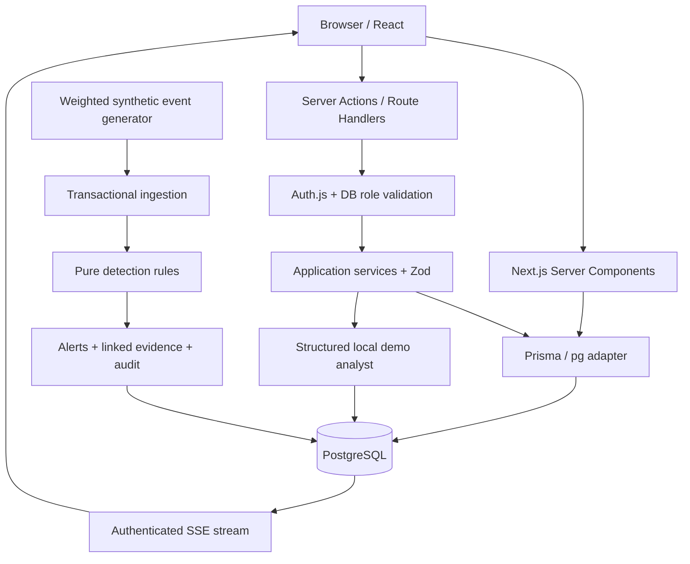

# Architecture de PulseOps

Version implémentée — 28 septembre 2026. Le produit est un monolithe modulaire pour une organisation fictive. Ce document décrit le code présent, pas une architecture hypothétique. Voir [VALIDATION.md](VALIDATION.md) pour les limites des vérifications.

## Vue globale

Next.js sert l'interface et le backend. Un service FastAPI séparé n'apporterait pas assez de valeur ici pour justifier deux runtimes, deux contrats d'authentification et un second déploiement. Le simulateur réutilise les mêmes services TypeScript.

## Dossiers et frontières

- `src/app` : routes, layouts, Server Actions, points d'entrée HTTP.
- `src/features` : interactions React propres aux alertes, incidents, tableaux de bord et préférences.
- `src/components` : structure de navigation, primitives accessibles et composants communs.
- `src/lib` : types métier, schémas Zod et fonctions pures utilisables des deux côtés.
- `src/server` : accès DB, autorisation, détection, simulation, analyse et services métier.
- `prisma` : schéma, migration SQL et seed idempotent.
- `tests` : unités, composants, intégration DB et parcours navigateur.

Les pages sont des Server Components. Les formulaires, graphiques Recharts, notifications, palette et flux SSE sont des Client Components. Seuls des objets sérialisables sélectionnés sont transmis au navigateur. Aucune connexion Prisma ni clé d'environnement n'y est exposée, à l'exception du mot de passe du compte public de démonstration lorsque DEMO_MODE est activé.

## Données et relations

`User` représente un compte SOC qui se connecte. `MonitoredIdentity` représente une personne fictive observée. Les confondre donnerait involontairement un accès applicatif à chaque identité surveillée.

Un événement immuable possède une séquence monotone, une date d'occurrence, une date d'ingestion, une identité et un asset facultatifs. La clé `(source, sourceEventId)` rend l'ingestion idempotente. `AlertEvent` et `IncidentEvent` conservent les liens entre les preuves et les investigations. Un incident peut regrouper plusieurs alertes dans le modèle ; l'interface V1 crée un incident depuis une alerte ou un dossier indépendant. La fusion manuelle d'alertes existantes est une évolution V2.

Les alertes et incidents ont une `version` pour empêcher les mises à jour obsolètes. Les index correspondent aux fenêtres de détection, aux filtres d'alertes, aux recherches par identité/IP et à la pagination. La recherche textuelle globale utilise `contains` avec limites de résultats : correcte à l'échelle de la démo, à remplacer par des index trigrammes ou plein texte pour un corpus important.

`Account` et `Session` sont présents pour une évolution OAuth, mais le flux Credentials actuel utilise des JWT : ces tables ne sont pas artificiellement remplies.

## Authentification et RBAC

Auth.js v5 beta est verrouillé dans le lockfile. C'est un compromis explicite pour son API App Router ; une montée de version exige de rejouer le parcours de connexion.

1. Zod valide email et mot de passe.
2. Deux compteurs PostgreSQL limitent les tentatives par email haché et globalement.
3. Argon2id vérifie le mot de passe. Un hash factice évite de court-circuiter le calcul pour un email inconnu.
4. Auth.js signe/chiffre son JWT dans un cookie HttpOnly ; la session expire après quatre heures. HTTPS active les cookies sécurisés.
5. Chaque page/API/action protégée relit l'utilisateur actif, son rôle et sa `sessionVersion`.
6. Les mutations revalident encore ces droits **dans leur transaction**, sous verrou d'acteur.

| Rôle    | Lecture | Analyse / triage / incidents | Rôles / organisation / audit global |
| ------- | ------- | ---------------------------- | ----------------------------------- |
| VIEWER  | Oui     | Non                          | Non                                 |
| ANALYST | Oui     | Oui                          | Non                                 |
| ADMIN   | Oui     | Oui                          | Oui                                 |

Changer un rôle incrémente `sessionVersion`, ce qui invalide les anciennes sessions. Le dernier administrateur actif ne peut pas être rétrogradé. Le compte public est ANALYST. Le mot de passe administrateur n'est jamais fourni par défaut. Pas de MFA ni de réinitialisation de mot de passe dans V1 ; ces absences sont indiquées dans Settings.

## Moteur de détection

`rules.ts` est une fonction pure : événement + historique → détections. La fenêtre est de cinq minutes et exclut les événements futurs. Les preuves sont des IDs d'événements existants.

| Règle           | Condition                                                                | Niveau         |
| --------------- | ------------------------------------------------------------------------ | -------------- |
| AUTH-001        | Au moins 5 échecs pour une identité                                      | MEDIUM         |
| AUTH-002        | Au moins 15 échecs depuis une IP                                         | HIGH           |
| AUTH-003        | Au moins 10 échecs, puis succès signalé depuis un nouveau pays           | CRITICAL       |
| Signaux directs | Malware simulé, élévation, brute force, abus API, téléchargement suspect | Selon la règle |

La donnée `newCountry` est fournie par le scénario normalisé ; le moteur ne prétend pas disposer d'un service de géolocalisation réel. Les règles directes et la corrélation sont séparées pour rendre les tests lisibles.

L'orchestrateur prend un verrou transactionnel d'ingestion, vérifie la déduplication, insère l'événement, charge au plus 500 échecs pertinents, applique les règles et persiste alerte, preuves, audit et notification atomiquement. Les détections de même règle et même sujet sont regroupées pendant cinq minutes. Une alerte clôturée n'est pas rouverte automatiquement dans cette fenêtre ; les nouvelles preuves restent attachées. Les nouvelles occurrences hors fenêtre produisent une nouvelle alerte.

Le verrou global privilégie la correction d'une petite démo. Pour monter en charge : partitions par sujet, ordre de verrouillage explicite, queue durable et tests de concurrence sur PostgreSQL natif. Aucun débit de SIEM de production n'est revendiqué.

## Temps réel et simulation

Le worker Docker appelle le générateur pondéré toutes les quatre secondes. Sur Vercel, un navigateur analyste appelle un endpoint de démonstration toutes les cinq secondes lorsqu'un flux est ouvert. Un état verrouillé en DB permet au plus un tick global toutes les quatre secondes, quel que soit le nombre d'onglets. Un lecteur ne génère pas de données.

Le GET SSE est strictement lecteur. Il consulte les événements toutes les 2,5 secondes, envoie des IDs de séquence, des heartbeats et se termine après 24 secondes. EventSource se reconnecte avec Last-Event-ID ; ce format reste compatible avec une fonction de durée limitée. Une interruption importante charge un snapshot des 50 derniers événements et l'annonce dans l'interface. Le client conserve au plus 200 lignes. Pause ferme la connexion ; reprendre rouvre le flux. La session est revalidée à chaque cycle.

Le streaming ne met pas à jour tous les indicateurs du dashboard à chaque événement : les compteurs sont un instantané au chargement, le feed est en direct. Les notifications sont interrogées toutes les 30 secondes. Les recherches du feed ne portent que sur ses 200 événements ; la recherche globale interroge la base.

## Analyse structurée

La version disponible est **DEMO**, déterministe et locale. Elle transforme la règle et ses preuves en résumé, niveau, références, recommandations, confiance illustrative et limites. Le résultat est validé par Zod, puis chaque référence est vérifiée contre les preuves autorisées. Une analyse est persistée avec son auteur, mode, version de prompt et hash des preuves ; sa création est auditée. Aucun bouton ne contient de réponse brute ou de commande de remédiation.

Le module `context.ts` prépare une liste blanche pour une future intégration externe : types d'événements fictifs, références locales E1/E2 et délais relatifs. Noms, emails, IP, identifiants DB, dates absolues et texte libre sont exclus. Les tests rejettent les données non simulées ou de provenance inconnue. **Aucun appel externe n'est activé dans cette version.** Les modes LIVE/FALLBACK du modèle sont réservés à cette extension, sans prétendre qu'elle est en service.

## Sécurité des mutations

Les Server Actions sont des endpoints : chacune authentifie, autorise et valide l'entrée. Les API de mutation vérifient l'Origin. Auth.js protège son flux de connexion contre le CSRF ; Next.js vérifie l'origine des Server Actions. Les entrées sont rendues comme texte React, sans HTML injecté. Les requêtes SQL manuelles utilisent les templates paramétrés Prisma.

Une CSP avec nonce par requête protège les scripts. `unsafe-eval` n'est permis qu'en développement ; les styles inline restent autorisés pour Recharts et les composants de thème. Frame-ancestors, X-Frame-Options, nosniff, Referrer-Policy et Permissions-Policy complètent ces protections. Le proxy ne remplace pas les contrôles d'accès dans le serveur.

Les quotas utilisent des compteurs PostgreSQL et restent cohérents entre instances. V1 ne dispose pas de nettoyage périodique des anciennes clés ni de protection DDoS dédiée. Le déploiement public doit rester une démonstration, avec protections de plateforme et limites de consommation.

## Calculs explicables

Score global : `max(0, 100 − somme des poids des alertes OPEN/INVESTIGATING))`, avec LOW=1, MEDIUM=3, HIGH=7, CRITICAL=12. Snapshot horaire à l'activité du simulateur ou au triage. L'historique initial est reconstruit à partir des alertes fictives et de leurs résolutions.

Risque d'identité/asset : somme des poids actifs × 4, plafonnée à 100. Ce sont des heuristiques pédagogiques, pas des probabilités calibrées. Le score peut atteindre zéro si la simulation accumule des alertes sans analyste.

## Déploiement et limites

Docker exécute une app Node standalone, PostgreSQL, un job de migration/seed et le worker. Sur Vercel, PostgreSQL est distant et le tick passe par le navigateur ; aucun worker permanent n'est promis. PGlite est seulement une option locale sans Docker et ne remplace pas les tests de concurrence sur PostgreSQL natif.

La V1 est mono-organisation. Ajouter du multi-tenant exigerait des clés tenant sur les données, filtres systématiques, contraintes composées et tests d'isolation. L'audit est append-only dans l'application, pas cryptographiquement inviolable. Les commentaires, données et preuves persistent ; aucune purge ni action offensive n'est disponible dans l'interface.
