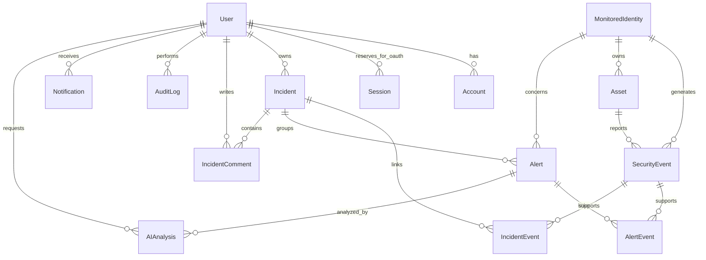

# Data model

The authoritative schema is `prisma/schema.prisma`. The migration SQL is versioned in `prisma/migrations`. UUIDs identify records; a separate BigInt sequence orders stream delivery.

| Model                    | Responsibility                                                                        |
| ------------------------ | ------------------------------------------------------------------------------------- |
| User                     | SOC login, role, active state, Argon2 hash, session version and preferences           |
| Account / Session        | Future OAuth adapter compatibility; not populated by Credentials JWT sessions         |
| MonitoredIdentity        | Fictional observed person; never an application login by implication                  |
| Asset                    | Fictional device, operating system, owner, IP, status and last seen                   |
| SecurityEvent            | Validated immutable observation, source deduplication key and ordered stream sequence |
| Alert / AlertEvent       | Rule result, workflow state, suppression window and supporting evidence               |
| Incident / IncidentEvent | Investigation owner, optimistic version, resolution and attached evidence             |
| IncidentComment          | Analyst note with author and timestamp                                                |
| AIAnalysis               | Validated structured result, mode, requester, prompt version and evidence hash        |
| Notification             | Recipient-owned inbox item with a deduplication key and read timestamp                |
| AuditLog                 | Actor/action/resource/timestamp; IP is optional and currently not collected           |
| ScoreSnapshot            | Hourly score, active alert count, formula version and simulation marker               |
| SimulationState          | Persisted global tick counter and idempotent seed checkpoints                         |
| RateLimitBucket          | Atomic database counters with expiry                                                  |
| ApplicationSettings      | Single fictional workspace configuration                                              |

`createdAt` / `updatedAt` are used on mutable business records. Events, comments and audit entries are append-only through the application's normal write paths and do not need fake update timestamps.

Enum columns constrain severities, statuses, roles, asset states, event types and categories. Composite keys constrain evidence links; `(source, sourceEventId)` prevents duplicate ingestion. References to security events use restrictive deletion. There is deliberately no UI that deletes evidence.

Alert and incident updates use `WHERE id = ? AND version = ?`; an update count of zero is a conflict. The associated audit is written in the same transaction. These details matter more than adding more models.
