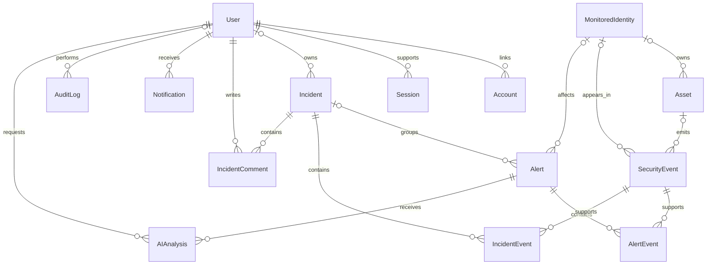

# PulseOps — schéma de données proposé

Statut : conception de phase 2. Ce document n'est pas encore un schéma Prisma exécutable. Sa traduction, sa validation Prisma, ses migrations et ses tests PostgreSQL appartiennent à la phase 4.

## Séparation des identités

`User` représente l'opérateur du SOC qui se connecte : analyste, administrateur ou lecteur. `MonitoredIdentity` représente une personne fictive dont l'activité est surveillée. `/users` affiche les secondes ; Settings → Users administre les premières. Cette séparation empêche de confondre « personne à risque » et « compte autorisé à utiliser PulseOps ».

## Relations principales

Un owner d'incident peut être absent lors du triage. Les notifications et audits identifient également leur ressource. Les tables de configuration/snapshots ne sont pas dessinées pour garder le diagramme lisible.

## Enums

| Enum | Valeurs |
| --- | --- |
| UserRole | ADMIN, ANALYST, VIEWER |
| Severity | LOW, MEDIUM, HIGH, CRITICAL |
| AlertStatus | OPEN, INVESTIGATING, RESOLVED, FALSE_POSITIVE |
| IncidentStatus | OPEN, INVESTIGATING, CONTAINED, RESOLVED |
| EventType | NORMAL_LOGIN, FAILED_LOGIN, NEW_DEVICE, NEW_COUNTRY, BRUTE_FORCE, PRIVILEGE_ESCALATION, MALWARE_DETECTED, SUSPICIOUS_DOWNLOAD, API_ABUSE |
| EventCategory | AUTHENTICATION, IDENTITY, ENDPOINT, NETWORK, DATA, API |
| AssetStatus | ONLINE, OFFLINE, UNKNOWN |
| AnalysisMode | LIVE, DEMO, FALLBACK |
| AuditAction | LOGIN, ALERT_CREATED, ALERT_STATUS_CHANGED, INCIDENT_CREATED, INCIDENT_STATUS_CHANGED, INCIDENT_OWNER_CHANGED, COMMENT_ADDED, ROLE_CHANGED, SETTINGS_CHANGED, AI_ANALYSIS_CREATED |
| NotificationType | CRITICAL_ALERT, INCIDENT_ASSIGNED, SCORE_DECREASED, INCIDENT_RESOLVED |

La sévérité a un ordre métier explicite pour le tri ; ne pas supposer que l'ordre alphabétique respecte la criticité.

## Entités et colonnes

Les IDs métier sont des UUID. Toutes les dates sont stockées en UTC. `createdAt` et `updatedAt` existent sur les entités mutables ; les traces immuables possèdent uniquement leur date d'enregistrement et éventuellement celle de l'événement.

| Entité | Champs principaux et contraintes |
| --- | --- |
| User | id, name, email unique normalisé, emailVerified?, image?, passwordHash?, role, isActive, sessionVersion, preferences JSON validé, createdAt, updatedAt |
| Account | id, userId, type, provider, providerAccountId, champs tokens de l'adapter ; unique(provider, providerAccountId) ; créé/utilisé seulement si provider compatible configuré |
| Session | id, sessionToken unique, userId, expires ; structure compatible adapter, non utilisée par la stratégie Credentials/JWT retenue |
| MonitoredIdentity | id, name, email unique, department, isActive, homeCountry, knownCountries, lastLoginAt?, lastLoginCountry?, createdAt, updatedAt |
| Asset | id, hostname unique, operatingSystem, status, ipAddress?, lastSeenAt?, ownerId? → MonitoredIdentity, createdAt, updatedAt |
| SecurityEvent | id, sequence BigInt unique autoincrémentée, source, sourceEventId, type, category, severity, occurredAt, ingestedAt, identityId?, assetId?, ipAddress?, countryCode?, approximateLatitude?, approximateLongitude?, metadata JSON validé, simulated=true ; unique(source, sourceEventId) |
| Alert | id, reference unique lisible, title, description, severity, status, category, ruleId, ruleVersion, subjectKey, deduplicationKey unique, suppressionUntil, identityId?, sourceIp?, countryCode?, incidentId?, firstSeenAt, lastSeenAt, resolvedAt?, resolutionReason?, version, createdAt, updatedAt |
| AlertEvent | alertId, eventId, linkedAt ; clé primaire composée(alertId, eventId) |
| Incident | id, reference unique lisible, title, description, severity, status, ownerId? → User, createdById → User, resolvedAt?, resolutionSummary?, version, createdAt, updatedAt |
| IncidentEvent | incidentId, eventId, linkedAt ; clé primaire composée(incidentId, eventId) |
| IncidentComment | id, incidentId, authorId → User, body texte brut borné, createdAt ; pas d'édition silencieuse des commentaires en V1 |
| AIAnalysis | id, alertId, requestedById, mode, provider?, model?, promptVersion, schemaVersion, evidenceHash, result JSON validé, latencyMs?, createdAt |
| Notification | id, userId destinataire, type, title, body, alertId?, incidentId?, deduplicationKey, readAt?, createdAt ; unique(userId, deduplicationKey) |
| AuditLog | id, actorId? → User, actorType USER/SYSTEM, action, resourceType, resourceId, changes JSON borné, ipAddress?, requestId?, createdAt |
| ScoreSnapshot | id, bucketStart unique, score, activeAlerts, formulaVersion, simulated, measuredAt, createdAt |
| SimulationState | id singleton, seed, scenarioState JSON validé, nextTickAt, counter, updatedAt |
| RateLimitBucket | key primaire (aucun secret brut), count, windowStart, expiresAt |
| ApplicationSettings | id singleton, organizationName, timezone par défaut, demoEnabled, updatedById? → User, createdAt, updatedAt |

Les préférences User contiennent thème, timezone d'affichage et types de notifications activés, avec schéma Zod versionné. Les paramètres affectant la sécurité du déploiement restent dans l'environnement, pas dans un formulaire modifiable par un visiteur demo. `demoEnabled` ne peut jamais activer la simulation si l'environnement interdit DEMO.

Les `metadata` d'événement suivent une union discriminée par EventType : par exemple nombre d'octets pour un téléchargement, chemin API normalisé pour API_ABUSE, ou indication de nouveau pays pour NORMAL_LOGIN. Les champs destinés aux filtres fréquents restent des colonnes, pas des recherches JSON arbitraires.

L'IP est complète et normalisée en stockage synthétique ; l'interface peut la masquer. La recherche utilise la valeur canonique. Le type SQL précis et ses validations seront confirmés avec Prisma à la phase 4.

## Contraintes et suppressions

- User désactivé plutôt que supprimé ; préserver auteurs, audits et historique.
- Suppression des événements probants interdite tant qu'ils sont référencés par une alerte ou un incident.
- Aucune suppression publique d'alertes, d'incidents ou d'audits en V1.
- Les tables de jointure empêchent les doublons par clé composée.
- Unicité de `Alert.incidentId` non requise : plusieurs alertes doivent pouvoir rejoindre le même incident. C'est une seule colonne par alerte qui assure au maximum un incident pour chaque alerte.
- Conversion : verrouiller l'alerte, vérifier incidentId, créer ou retourner l'incident existant, copier les preuves et écrire l'audit dans la même transaction.
- L'unicité de source/sourceEventId rend les événements idempotents.
- `deduplicationKey` est construite par le serveur avec règle/sujet/occurrence ; le verrou d'ingestion protège la sélection de l'occurrence active sur la fenêtre glissante.
- Des CHECK SQL complètent Prisma si nécessaire : score 0–100, cohérence resolvedAt/statut et types de notification/ressource. Zod ne remplace pas les contraintes DB.
- User.passwordHash peut être null pour un provider futur ; Credentials refuse alors la connexion.

## Index initiaux

| Table | Index | Requête visée |
| --- | --- | --- |
| SecurityEvent | sequence unique | Reprise SSE |
| SecurityEvent | occurredAt, id | Fenêtres et pagination |
| SecurityEvent | identityId, type, occurredAt | Échecs d'une personne |
| SecurityEvent | ipAddress, type, occurredAt | Échecs d'une IP |
| SecurityEvent | assetId, occurredAt | Historique d'un endpoint |
| Alert | status, severity, createdAt, id | Triage |
| Alert | ruleId, subjectKey, suppressionUntil | Déduplication d'occurrence |
| Alert | identityId, createdAt | Profil de risque |
| Alert | incidentId | Alertes liées à un incident |
| Incident | status, severity, createdAt, id | Liste d'investigations |
| Incident | ownerId, updatedAt | Travail attribué |
| IncidentComment | incidentId, createdAt | Timeline |
| Notification | userId, readAt, createdAt | Badge et liste |
| AuditLog | resourceType, resourceId, createdAt | Historique de ressource |
| AuditLog | actorId, createdAt | Audit administratif |
| AIAnalysis | alertId, evidenceHash, promptVersion, createdAt | Réutilisation d'analyse |
| RateLimitBucket | expiresAt | Nettoyage borné |

Les clés étrangères et index seront revus avec EXPLAIN sur les requêtes réelles. Pas d'index ajouté seulement pour cocher une case.

## Transitions métier

Alertes : OPEN → INVESTIGATING → RESOLVED ou FALSE_POSITIVE. La résolution directe depuis OPEN est permise avec motif. Réouvrir une alerte close exige une action explicite et auditée.

Incidents : OPEN → INVESTIGATING → CONTAINED → RESOLVED ; résolution depuis INVESTIGATING possible avec résumé. CONTAINED est un état déclaré par l'analyste, sans action sur une machine externe.

Créer un incident passe les alertes concernées à INVESTIGATING. Résoudre l'incident ne clôt pas silencieusement toutes ses alertes : une option explicite, validée et auditée réalise une clôture groupée. La version optimiste protège contre les mises à jour concurrentes.

## Vues dérivées

- Risque utilisateur et asset calculé depuis les alertes actives liées aux preuves ; ne pas compter deux fois la même alerte via plusieurs événements.
- Nombre d'incidents d'une personne : incidents distincts liés à ses alertes ou événements.
- IP, pays et devices d'un profil : historique agrégé des SecurityEvents.
- Timeline d'incident : événements liés, commentaires et projection autorisée des audits de cet incident. Les lecteurs SOC ne reçoivent jamais tous les audits administratifs.
- Les détails AIAnalysis restent validés en JSON ; les IDs de preuve doivent appartenir aux AlertEvent au moment de génération. Le snapshot et le hash conservent le contexte analysé.

## Vérifications prévues à la phase 4

Validation et format Prisma, migration sur PostgreSQL vide, contrôle des clés et actions de suppression, seed exécuté deux fois sans doublon, requêtes principales, cohérence temporelle et tests des contraintes. Aucune validation de schéma exécutable n'a encore été effectuée.
